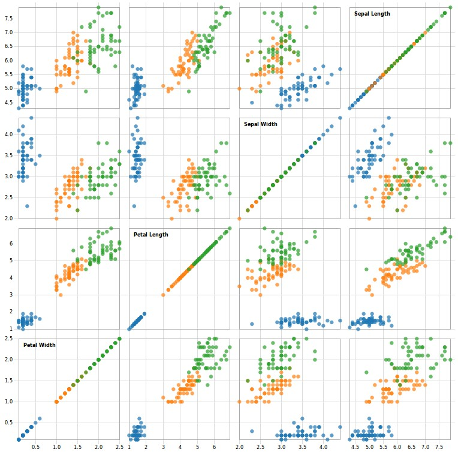
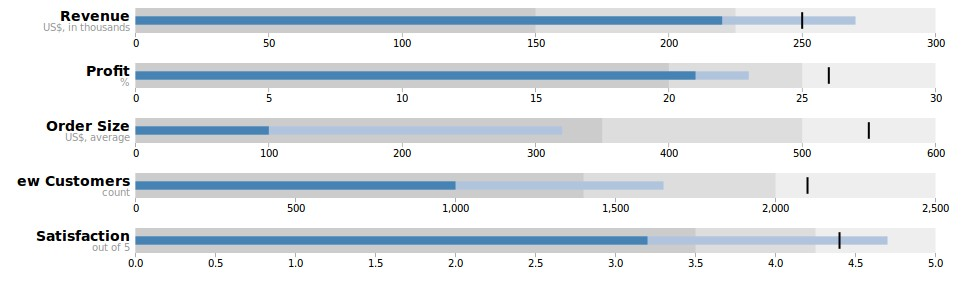
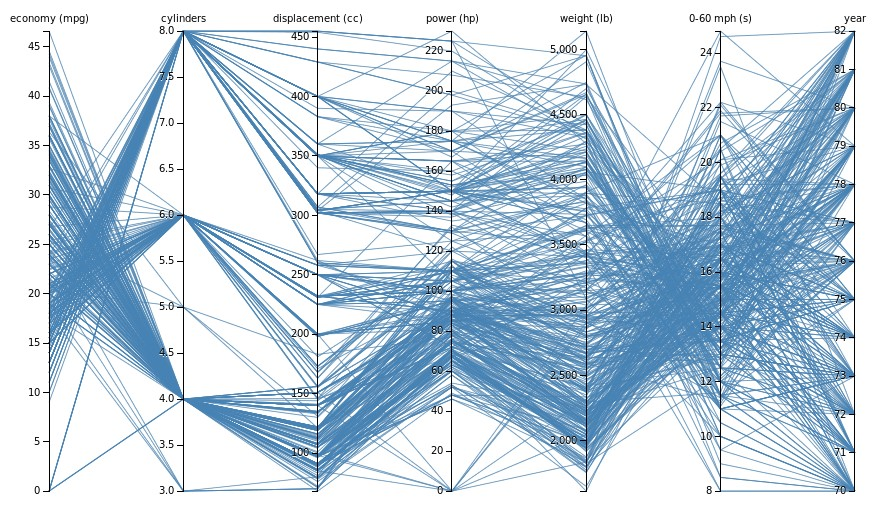

% Bokeh
% Juan Morales del Olmo
% 21 de abril de 2016


# Overview #

## ¿Qué es Bokeh? ##

* Libería de visualización de datos
* Se programa en Python, renderiza en navegador (Javascript)
* Bindings para otros lenguajes como R o Julia
* Permite interacción

-------------------------------------------------------------------------------

## APIs

- Tres niveles de interfaz para los usuarios:

	> - Interfaz de bajo nivel **bokeh.models**: Sólo para a los desarrolladores de Bokeh.
	> - Interfaz de nivel intermedio **bokeh.plotting**: Cercano al concepto de "Visualization Grammar"
	> - Interfaz de alto nivel **bokeh.charts**: Dibuja Charts estándar rápidamente

-------------------------------------------------------------------------------


](rsc/bokeh_ejemplos.jpg)


-------------------------------------------------------------------------------

## Outputs

- Con **output_file("chart.html")** se indica el fichero de salida

- Con **save** se ejecuta y crea el html

- Con **show** se ejecuta, se crea el html y se abre en el navegador

-------------------------------------------------------------------------------

## Notebooks

- Bokeh se integra perfectamente con los cuadernos Jupyter 

- Para ver los ejemplos en un notebook, se puede cambiar **output_file()**
  por **output_notebook()**


-------------------------------------------------------------------------------

## Plotting API

```
# create a Figure object
p = figure(width=800, height=500, tools="pan,reset,save")

# add a Circle renderer to this figure
p.circle([1, 2.5, 3, 2], [2, 3, 1, 1.5], radius=0.3, alpha=0.5)

# specify how to output the plot(s)
output_file("circles.html")

show(p)
```
-------------------------------------------------------------------------------

<iframe width="100%" height="800" src="rsc/circles.html">
	](../rsc/images/link.png)

</iframe>


## Pasos básicos Plotting:

1. Preparar algunos datos (listas de Python o **DataFrames** de [Pandas](http://pandas.pydata.org/)).
2. Indicar fichero de salida (output_file ("plot.html")).
3. Llamar a figure() para crear un gráfico con algunas opciones generales como el título, herramientas y etiquetas de los ejes.
4. Añadir **Marcas** especificando parámetros como color, leyendas, etc.
5. Renderizar la gráfica (show o save).

----------------------------------------------------------------------------

## Aspecto visual

- Configurar los parámetros del Figure:
	- Tamaño
	- Títulos
	- Ejes
	- ...

- Configurar los parámetros de la Marca:
	- El color (fill_color, fill_alpha)
	- El tamaño
	- La fuente de la letra
	- El estilo de la línea
	- ...

- Revisar la [documentación](http://bokeh.pydata.org/en/latest/docs/user_guide/styling.html)

----------------------------------------------------------------------------

## Chart API

```
from bokeh.charts import Scatter, output_file, show

# prepare some data, a Pandas GroupBy object in this case
from bokeh.sampledata.autompg import autompg as df

# create a scatter chart
p = Scatter(df, x='mpg', y='hp', color='cyl',
            title="MPG vs HP (colored by CYL)",
            legend='top_right',
            xlabel="Miles Per Gallon",
            ylabel="Horsepower")

# specify how to output the plot(s)
output_file("chart.html")

# display the figure
show(p)
```
-------------------------------------------------------------------------------

<iframe width="100%" height="800" src="rsc/charting.html">
	](../rsc/images/link.png)
</iframe>


# Ejercicios

## Ejercicio 1

- Usando Bokeh intenta generar una gráfica que:

	- Visualice 5 marcas situadas en [x, y] diferentes (numpy.random)
	- Utilicen un radio diferente de entre 10 y 30
	- Utilice asteriscos como marcas
	- El color sea "firebrick"
	- El ancho de la linea sea 3

--------------------------------------------------------------------------------

<iframe width="100%" height="800" src="rsc/asterisk.html">
	](../rsc/images/link.png)
</iframe>

## Ejercicio 2

- Añade un título a la gráfica (parámetro de la figura)
- Añade etiquetas a los ejes x e y (parámetro de la marca)
- Deja sólamente la interacción "pan"

## Ejercicio 3

- Carga el dataset `import bokeh.sampledata.iris as df`
- Usando el chart `Scatter` genera la siguiente gráfca

--------------------------------------------------------------------------------

<iframe width="100%" height="800" src="rsc/iris_simple.html">
	](../rsc/images/link.png)
</iframe>

## Ejercicio 4

- Repite el mismo plot, esta vez utilizando `bokeh.plotting` en vez de Charts

## Ejercicio 5

- Usando [gridplot](http://bokeh.pydata.org/en/latest/docs/reference/io.html#bokeh.io.gridplot)
  crea un Scatter Plot Matrix del dataset `Iris` similar al siguiente:

[](http://bl.ocks.org/mbostock/raw/4063663/)


## Ejercicio 6

- Usando la API de Yahoo, descarga los datos de GOOG, AAPL, IBM 

```
AAPL = pd.read_csv(
    "http://ichart.yahoo.com/table.csv?s=AAPL&a=0&b=1&c=2000&d=0&e=1&f=2010",
    parse_dates=['Date'])
```

- Muestra la tabla de un DataFrame y mira qué columnas tiene 

## Ejercicio 7

- Pinta el valor total de las empresas GOOG, AAPL, IBM desde 2000 hasta 2016

<iframe width="100%" height="800" src="rsc/timeseries.html">
	](../rsc/images/link.png)
</iframe>

## Ejercicio 8

- Pinta los rangos de cada día (apertura y cierre), con un cuadrado por día. Sólo lo que llevamos de 2016.
- Los días con ganancias con color verde, las pérdidas en rojo
- Utilizando vplot pinta las 3 compañías

## Ejercicio 9

- Modifica el ejercicio 8 para crear un [diagrama de velas](https://es.wikipedia.org/wiki/Gr%C3%A1fico_de_velas) completo

## Ejercicio 10

- Crea un Bullet Chart con estos [datos](http://gist.githubusercontent.com/mbostock/4061961/raw/6eb742223b9795260ba62150196ed0ae4a461e39/bullets.json)

[](http://bl.ocks.org/mbostock/raw/4061961/)

## Ejercicio 11

- Con el dataset autompg crea un PCP

```
from bokeh.sampledata.autompg import autompg as df
```

[](http://bl.ocks.org/mbostock/raw/7586334/)


