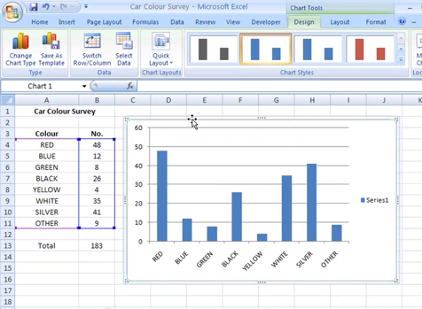
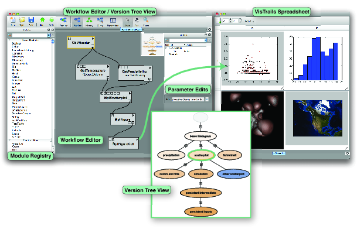
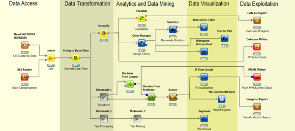
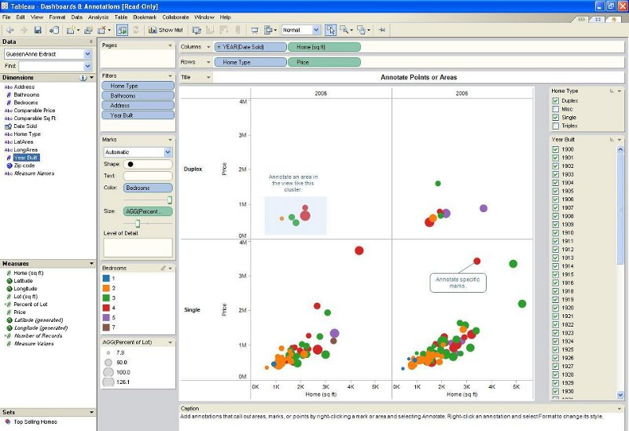
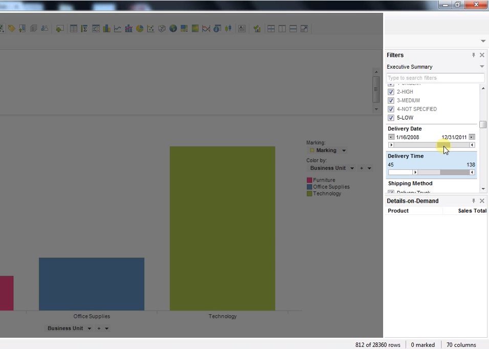
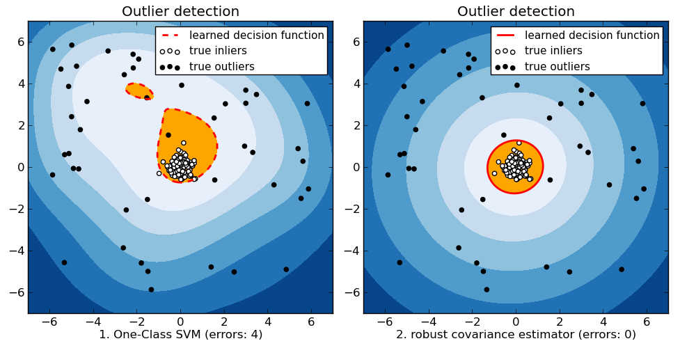
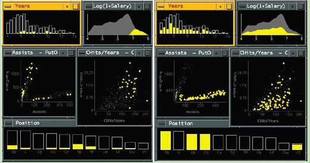
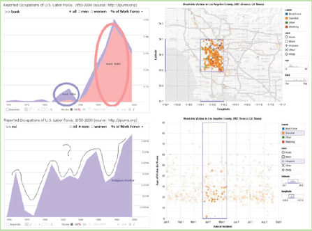

% Dinámicas en visual analytics
% Juan Morales del Olmo
% 17 de marzo de 2015

# Dinámicas para el análisis visual

## Taxonomías de tareas

Muchas propuestas. Por ejemplo:

* 7 tareas [Shneiderman, 96][]
	- Overview
	- Zoom
	- Filter
	- Details-on-demand
	- Relate
	- History
	- Extract

* 10 tareas [Stasko, 05][]
	- Retrieve Value
	- Filter
	- Compute Derived Value
	- Find Extremum
	- Sort
	- Determine Range
	- Characterize Distribution
	- Find Anomalies
	- Cluster
	- Correlate
	

## [Heer y Shneiderman, 2012][]

Especificación de datos y vistas
:   - Visualizar
	- Filtrar
	- Ordenar
	- Derivar

Manipulación de las vistas
:   - Seleccionar
	- Navegar
	- Coordinar
	- Organizar

Proceso y procedencia
:   - Registrar
	- Anotar
	- Compartir
	- Guiar

----------

12 tareas en 3 grupos

<http://queue.acm.org/detail.cfm?id=2146416>

# Visualizar

## Visualizar - Charts

## Charts - Programando
<iframe width="100%" height="800" src="http://www.highcharts.com/demo/line-basic" frameborder="1" allowfullscreen>
](../rsc/images/link.png)

</iframe>

## Visualizar - Flujo de datos

## Visualizar - Flujo de datos

## Flujo de datos - Programando

<iframe width="100%" height="800" src="http://www.vtk.org/Wiki/VTK/Examples/Cxx/Filters/GaussianSplat" frameborder="1" allowfullscreen>
](../rsc/images/link.png)

</iframe>

## Visualizar - Gramáticas

## Gramáticas - Programando

<iframe width="100%" height="800" src="http://trifacta.github.io/vega/editor/" frameborder="1" allowfullscreen>
](../rsc/images/link.png)

</iframe>

# Filtrar

## Filtrar

* Normalmente no se quiere ver toda la información a la vez

* Muy relacionado con la tarea de **Seleccionar**

## Filtrar - Queries dinámicas

## Visualizaciones como filtros

](../rsc/images/crossfilter.png)

# Ordenar
## Ordenar
<iframe width="100%" height="800" src="http://bl.ocks.org/mbostock/raw/3885705/" frameborder="1" allowfullscreen>
](../rsc/images/link.png)

</iframe>

# Derivar

## Hermanar con análisis de datos 

# Seleccionar

## Selección directa (brushing)

<iframe width="100%" height="800" src="http://bl.ocks.org/mbostock/raw/4063663/" frameborder="1" allowfullscreen>
](../rsc/images/link.png)

</iframe>

## Selección directa (lasso)

<iframe width="100%" height="800" src="http://bl.ocks.org/GerHobbelt/raw/3732612/" frameborder="1" allowfullscreen>
](../rsc/images/link.png)

</iframe>

## Selección indirecta
<iframe width="100%" height="800" src="http://bl.ocks.org/mbostock/raw/5180185/" frameborder="1" allowfullscreen>
](../rsc/images/link.png)

</iframe>

# Navegar

## Navegar es mover la cámara 

* Se usa la metáfora de la cámara.
 
	* En visualizaciones en 3D, la metáfora es directa. **Navegación geométrica**
	
	* En visualizaciones en 2D también puede serlo. (Pan and Zoom) **Navegación geométrica**

* Si cambiamos la representación (diferente de cambiar la proyección)
  de los items según se mueve la cámara estaremos hablando de
  **navegación semántica**

* La navegación se puede considerar una forma de filtrar items

## Zoom geométrico
<iframe width="100%" height="800" src="http://bl.ocks.org/mbostock/raw/3680958/" frameborder="1" allowfullscreen>
](../rsc/images/link.png)

</iframe>

## Zoom semántico
<iframe width="100%" height="800" src="http://bl.ocks.org/mbostock/raw/3681006/" frameborder="1" allowfullscreen>
](../rsc/images/link.png)

</iframe>

## Foco más contexto

<iframe width="100%" height="800" src="http://bl.ocks.org/mbostock/raw/1667367/" frameborder="1" allowfullscreen>
](../rsc/images/link.png)

</iframe>

## Distorsión ojo de pez

<iframe width="100%" height="800" src="http://bost.ocks.org/mike/fisheye/" frameborder="1" allowfullscreen>
](../rsc/images/link.png)

</iframe>

# Coordinar

## Small mulitples views

## Vistas múltiples coordinadas

<iframe width="640" height="480" src="http://www.youtube.com/embed/Tzsv6wkZoiQ?rel=0&start=84&end=107" frameborder="1" allowfullscreen>
](../rsc/images/link.png)

</iframe>

## Brushing and linking

<iframe width="100%" height="800" src="http://bl.ocks.org/mbostock/raw/4063663/" frameborder="1" allowfullscreen>
](../rsc/images/link.png)

</iframe>

# Organizar

## Organizar

# Registrar

## Registrar

* Cuando se presenta el resultado de un análisis lo habitual es que se pida **poder explicar** todos los pasos que han llevado a la conclusión

* Si se obtienen datos de **múltiples fuentes** es necesario conocer de dónde vino qué

* Las herramientas de **análisis exploratorio** fomentan la visualización
  de cientos de vistas y configuraciones diferentes. Algunas de ellas
  darán lugar a la creación de **hipótesis**. Tener un **registro** de todo el
  proceso es necesario para no pasar nada por alto.

# Anotar

## Anotar

* El analista debe ser capaz de describir sus ideas o hallazgos en el mismo sitio que surgen
* Permitir resaltar elementos destacados
* Básico para comunicar los resultados

# Compartir

## Compartir

* Exportar las vistas para los informes
* Poder exportar o guardar todos los ajustes para regresar a la visualización concreta
* Interactuar varios analistas a la vez sobre la misma herramienta

# Guiar

## Guiar

<iframe width="100%" height="800" src="http://www.nytimes.com/interactive/2013/02/04/science/girls-lead-in-science-exam-but-not-in-the-united-states.html" frameborder="1" allowfullscreen>
](../rsc/images/link.png)

</iframe>

[Shneiderman, 96]: http://ieeexplore.ieee.org/xpl/login.jsp?tp=&arnumber=545307&url=http%3A%2F%2Fieeexplore.ieee.org%2Fxpls%2Fabs_all.jsp%3Farnumber%3D545307

[Stasko, 05]: http://www.cc.gatech.edu/~john.stasko/papers/infovis05.pdf

[Heer y Shneiderman, 2012]: https://queue.acm.org/detail.cfm?id=2146416
