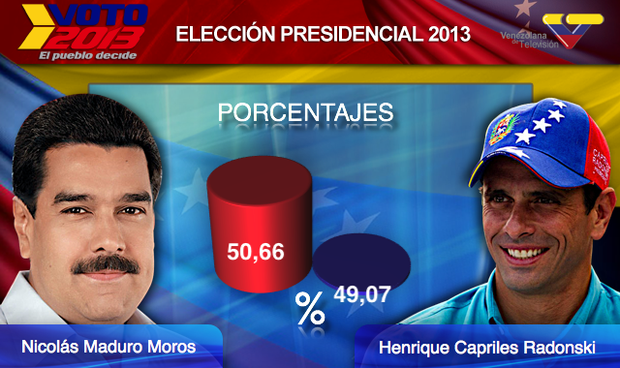

% Casos
% Juan Morales del Olmo
% 21 de marzo de 2014

# Estudio de casos

## 

](../rsc/images/viento-1.png)

## 

](../rsc/images/viento-2.png)

##

##

##

##

##

##
](../rsc/images/gapminder.png)
