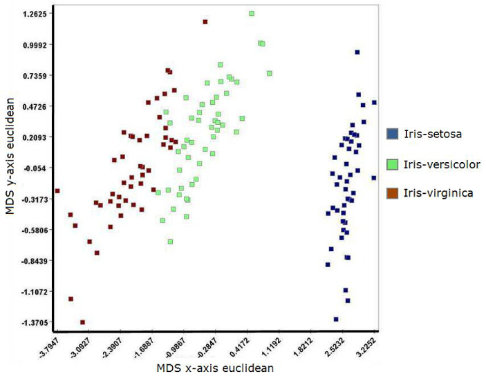
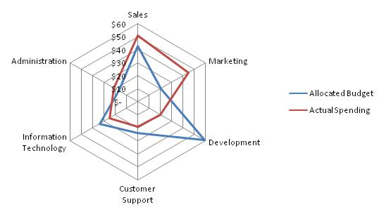
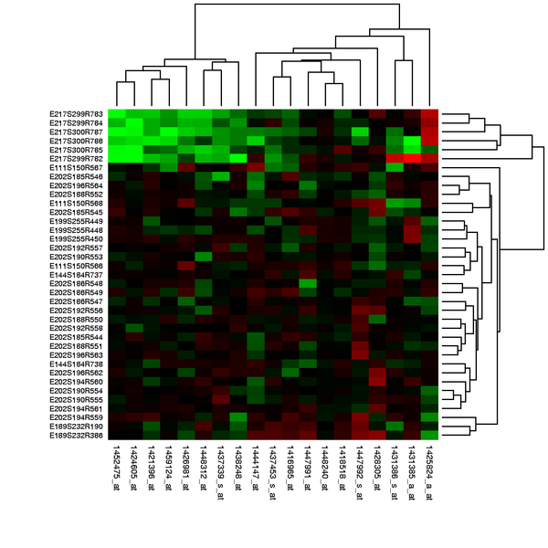
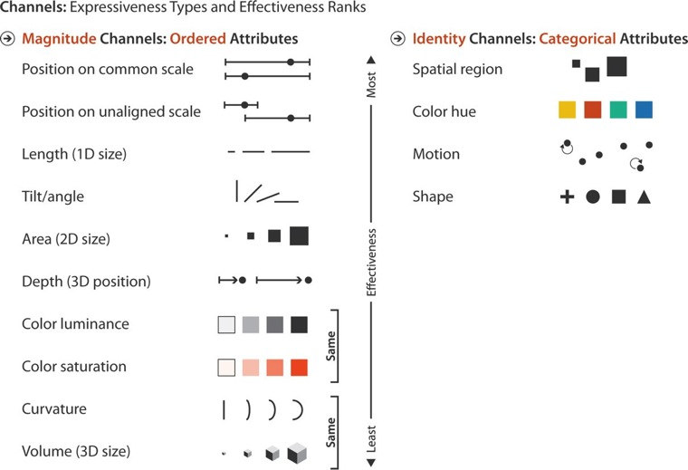

% Datos Multivariados
% Juan Morales del Olmo
% 19 de abril de 2016

# Datos Multivariados

## Características

* Usualmente conocidos como datos **Tabulares** o **Multidimensionales**
* Formatos comunes: Excel(xls, xlsx), texto (csv, tsv, ...)

* Formado por **items**, muestras o individuos (filas) y **campos**, dimensiones o variables (columnas)

## El problema

* **Muchas dimensiones que representar gráficamente de forma efectiva**

* Informalmente: "No podemos ver más de 3 dimensiones"
	* Sólo cierto si cada dimensión se *mapea*, en un mismo espacio, utilizando la variable visual **"Posición"**.

## Objetos de estudio típicos:

* Correlaciones
* Regresiones
* Clasificaciones
* Agrupaciones (clustering)
* Análisis de varianza.

# Representaciones basadas en puntos

## Estrategias

* Submuestreo de dimensiones

* Multiples vistas

* Reducción de la dimensionalidad

## Scatter Plots

## Scatter Plots Matrix

<iframe width="100%" height="800" src="http://bl.ocks.org/mbostock/raw/4063663/" frameborder="1">
	](../rsc/images/link.png)
	
</iframe>

## Correlation Matrix

## Reducción de dimensionalidad

Muchísimos metodos: MDS, PCA, StarCoordinates, ...

## Grand Tour

<video src="../rsc/videos/grand-tour.webm" controls>
 ](../rsc/images/link.png)

</video>

# Basados en líneas

## Gráfico de líneas multivariado

## Coordenadas Paralelas

<iframe width="100%" height="800" src="http://bl.ocks.org/mbostock/raw/7586334/" frameborder="1">
](../rsc/images/link.png)

</iframe>

## Gráfica de Radar

# Basados en regiones

## Gráficos de barras agrupados y apilados

<iframe width="100%" height="800" src="http://bl.ocks.org/mbostock/raw/3943967/" frameborder="1">
](../rsc/images/link.png)

</iframe>

## Bullet chart

<iframe width="100%" height="800" src="http://bl.ocks.org/mbostock/raw/4061961/" frameborder="1">
](../rsc/images/link.png)

</iframe>

## Gráficos en mosaico

## Heatmap

# Explotar canales gráficos

##

## Glifos

## Caras de Chernoff 

# Estrategias Interactivas

## Ordenado según campos

## Vistas enlazadas

<iframe width="100%" height="800" src="http://selfiecity.net/selfiexploratory/" frameborder="1" allowfullscreen>
](../rsc/images/link.png)

</iframe>

