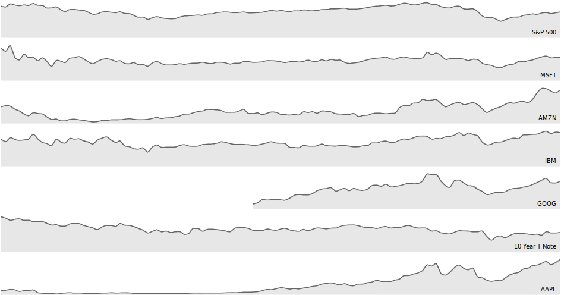

% Datos Temporales
% Juan Morales del Olmo
% 8 de abril de 2015

# Datos Temporales

## Conjuntos de datos temporales ##

* **Un conjunto de datos es temporal si al menos una de sus variables es
  temporal**

* El tiempo no es más que una variable cuantitativa pero:
	* Nos da la **dirección de la causalidad** si esta existe 
	* Es importante en la mayoría de escenarios
	* Múltiples escalas que se usan indistintamente (segundos, días, semanas, quincenas, meses, ...)

* Suele derivarse: (Medias móviles, Filtrado paso alto/bajo, T. Fourier, ... )

## Según subtipo de datos ##

Series temporales
:    Datos registrados con una cadencia (stocks, sensores, historia)
Eventos temporales
:    Hay cierta relación temporal entre los datos (intervalos, eventos puntuales)

# Según Disposición #

## Lineales ##

## Cíclicos ##

* Patrones repetidos

<iframe width="100%" height="800" src="http://prcweb.co.uk/lab/energy/" frameborder="1" allowfullscreen>
](../rsc/images/link.png)

</iframe>

## Ramificados ##

* Facilita descripción y comparación

# Visualizaciones

## Diagrama de horizonte ##

<iframe width="100%" height="800" src="http://bl.ocks.org/mbostock/raw/1483226/" frameborder="1" allowfullscreen>
](../rsc/images/link.png)

</iframe>

## Gapminder ##

](../rsc/images/gapminder.png)

## Vista de calendario ##

* Variación de heatmap

<iframe width="100%" height="800" src="http://bl.ocks.org/mbostock/4063318" frameborder="1" allowfullscreen>
](../rsc/images/link.png)

</iframe>

## Time Searcher ##

![TimeSearcher [Hochheiser @ HCIL]](../rsc/images/timesearcher.png)

## Life Lines ##

![LifeLines2 [David Wang @ HCIL]](../rsc/images/lifelines2.png)
