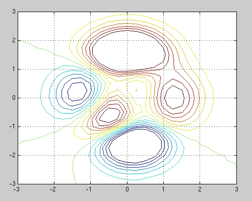
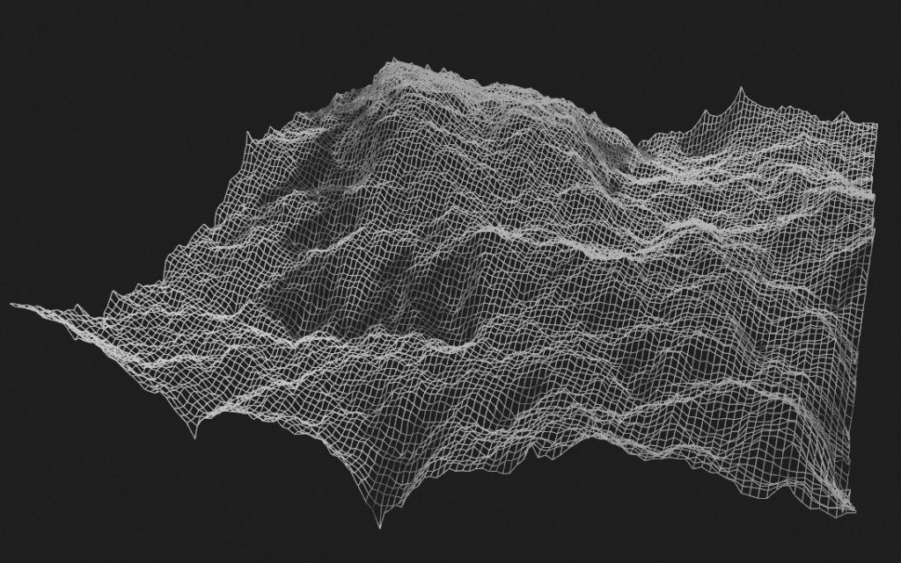
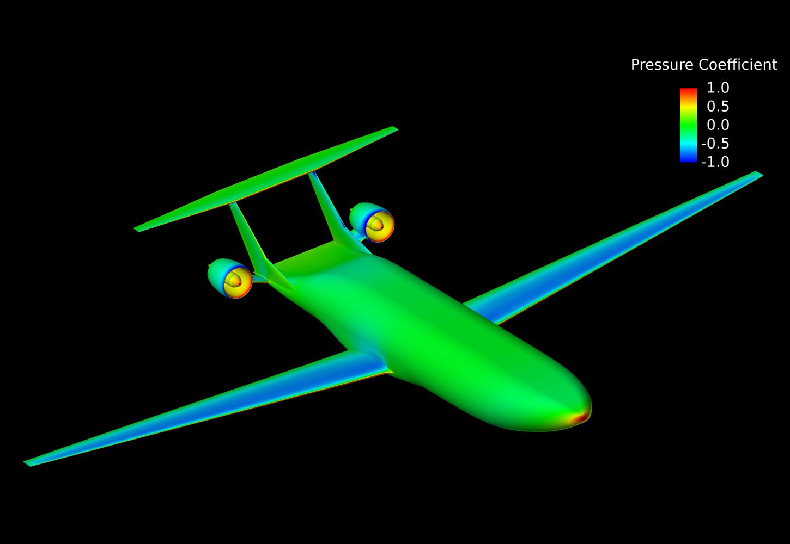
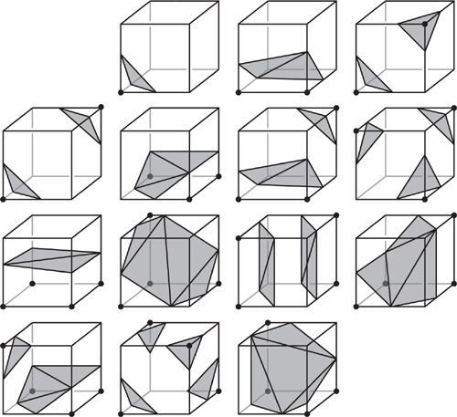
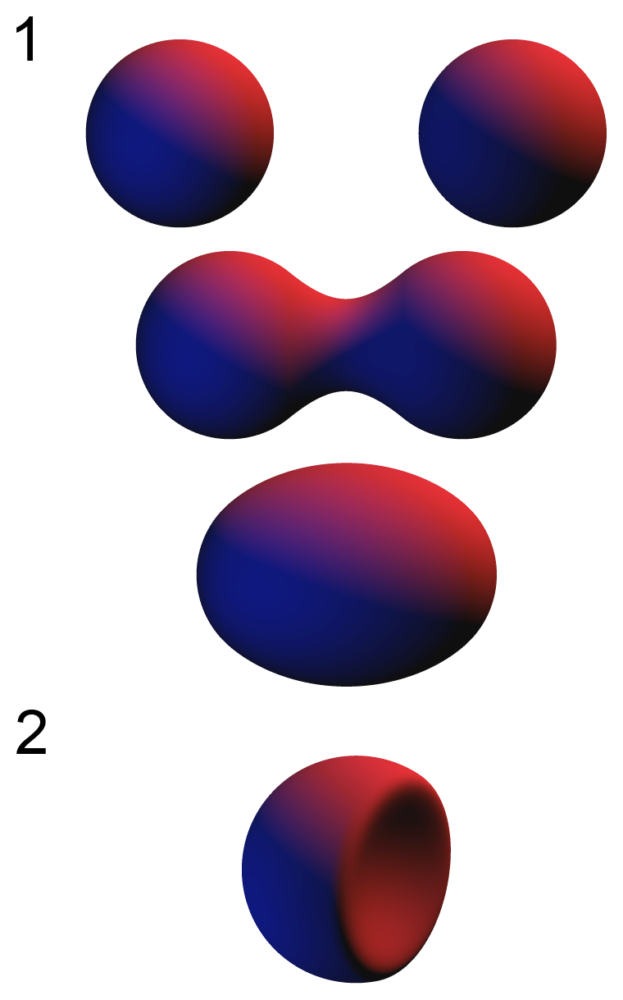
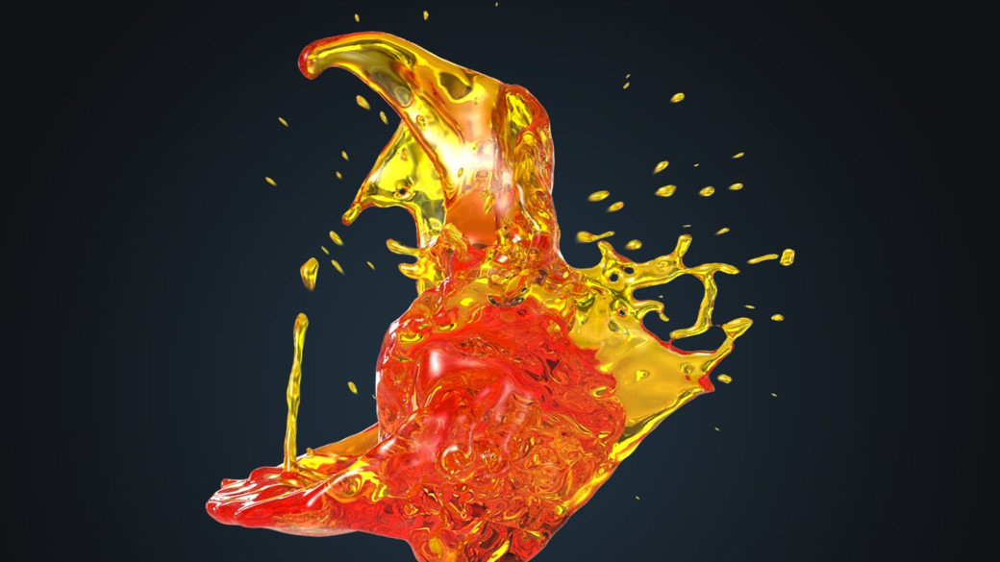
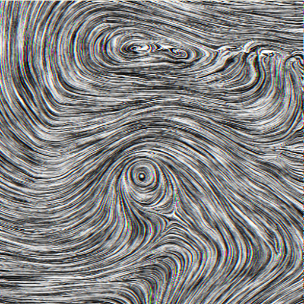
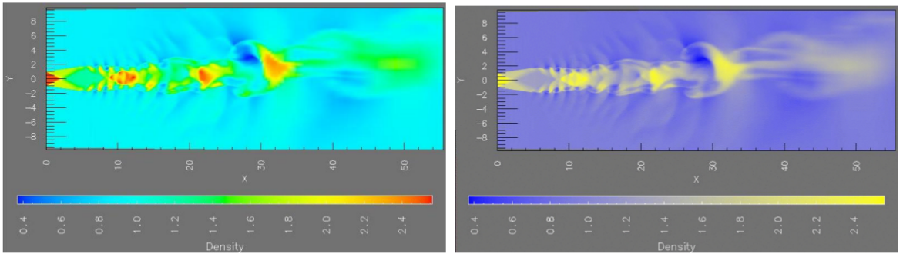

% Visualización científica
% Juan Morales del Olmo
% 16 de abril de 2015

# Visualización científica

## ¿Por qué la separación?

* Dos comunidades científicas

* InfoVis
	* Origen en interacción hombre-máquina
	* Background en **factores humanos**
* SciVis
    * Origen en Computer Graphics
	* Background en **3D**

## Datos espaciales

* Principalmente son datos espaciales (2D o 3D)
* A veces tienen una componente temporal

## Espacio de Diseño

* Suelen ser fáciles de diseñar e interpretar
	* La posición viene impuesta por los datos
	* Suelen representar objetos físicos plausibles
	* Estamos acostumbrados a relacionarnos con objetos 3D

# Datos 2D #

## 1 valor por posición: Imagen ##

## 1 valor por posición: IsoValores ##

## 1 valor de elevación por posición: Superficie ##

## n valores por posición: glifos en 3D ##

# Datos 3D #

## Superficies explícitas ##

* Vértices y facetas o curvas paramétricas
* Renderizado utilizando el cauce gráfico estándar

-------------------------------------------------------------------------------

## Datos volumétricos ##

* Valores Cuantitativos en una matriz de 3D
	* Imágenes tridimensionales.
		* ej: Imágenes de microscopio
	* Resultado de simulaciones.
		* ej: Temperatura en una sala

## Planos de corte ##

## Iso-superficies ##

-------------------------------------------------------------------------------

## Renderizado volumétrico directo ##

* Definir una función de transferencia (colores y opacidad)
* Dos técnicas
	* Forward mapping: Proyectar cada voxel al plano de cámara
	* Inverse mapping: Ray casting

-------------------------------------------------------------------------------

-------------------------------------------------------------------------------

## Superficies Implícitas ##

* Se definen con una función paramétrica
* La superficie definida es la que marcan los valores 0
* Ventajas a la hora de modelar superficies
	* ej: Metabolas
* A la hora de visualizarlos son volúmenes.
	* Marching cubes con threshold 0
	* Renderizado volumétrico

-------------------------------------------------------------------------------

# Datos dinámicos #

## Simulaciones de fluídos ##

* La gran mayoría son **simulaciones de fluídos**
* Un volumen de vectores por cada instante de tiempo
* El tiempo se suele mapear con transiciones
* Tipos de visualizaciones
	* Fotorealista
	* Glifos: flechas o tensores
	* Path Lines
	* Partículas
	* Line Integral Convolution

## Fotorealista ##

## Glifos ##

<video src="../rsc/videos/venas.webm" controls></video>

## Path Lines ##

<video src="../rsc/videos/streamline.webm" controls></video>

## Partículas ##

<video src="../rsc/videos/flujo-colores.webm" controls></video>

## Line Integral Convolution ##

# Percepción en SciVis

## 3D Justificado ##

* La necesidad de entender estructuras tridimensionales justifica el
  uso del 3D al 100%

* Recordemos los problemas:
	* Oclusiones
	* Distorsión por perspectiva
	* Dificultad para determinar la distancia
		* Estero alivia un poco... pero aun mucho mejor el plano

## Colores ##

* Se tiende a abusar de la escala **arco iris**

